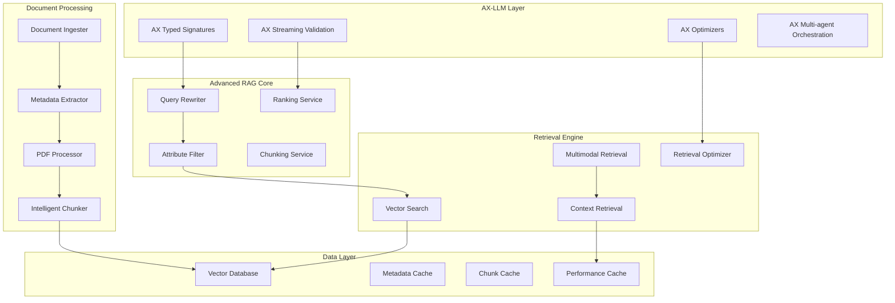

# Advanced RAG Integration with AX-LLM Design

## Overview

The Advanced RAG Integration combines OpenAI's sophisticated retrieval features (query rewriting, attribute filtering, ranking, PDF processing) with the AX-LLM framework's typed signatures and self-optimizing capabilities. This design provides intelligent document ingestion, enhanced chunking strategies, and optimized retrieval for industrial documentation.

## Architecture

### System Components



### Data Models

```typescript
// Advanced RAG with AX-LLM integration types
interface AxRAGSignature {
  input: {
    query: string;
    context?: string;
    filters?: AttributeFilters;
    options?: RetrievalOptions;
  };
  output: {
    answer: string;
    citations: Citation[];
    confidence: number;
    sources: RetrievalSource[];
  };
}

interface DocumentIngestionRequest {
  file: File | Buffer;
  metadata: DocumentMetadata;
  chunkingStrategy: ChunkingStrategy;
  processingOptions: ProcessingOptions;
  landingAIOptions?: LandingAIExtractionOptions;
}

interface LandingAIExtractionOptions {
  includeMarginalia?: boolean;
  includeMetadataInMarkdown?: boolean;
  fieldsSchema?: JSONSchema;
  pageRange?: string; // e.g., "0,1,2" for first 3 pages
  timeout?: number;
}

interface LandingAIChunk {
  text: string;
  grounding: any[];
  chunkType: string;
  chunkId: string;
}

interface LandingAIExtractionResult {
  markdown: string;
  chunks: LandingAIChunk[];
  extractedSchema: Record<string, any>;
  extractionMetadata: Record<string, any>;
  errors?: LandingAIError[];
}

interface DocumentMetadata {
  title: string;
  author?: string;
  documentType: DocumentType;
  equipmentModel?: string;
  safetyClassification: SafetyLevel;
  language: string;
  version: string;
  createdAt: Date;
  lastModified: Date;
  tags: string[];
  accessLevel: AccessLevel;
}

interface ChunkingStrategy {
  type: 'semantic' | 'structural' | 'hybrid';
  maxChunkSize: number;
  overlapSize: number;
  preserveStructure: boolean;
  respectBoundaries: string[];
}

interface AttributeFilters {
  documentType?: DocumentType[];
  equipmentModel?: string[];
  safetyLevel?: SafetyLevel[];
  dateRange?: DateRange;
  language?: string[];
  accessLevel?: AccessLevel[];
}

interface RetrievalResult {
  chunks: DocumentChunk[];
  totalResults: number;
  searchTime: number;
  rewrittenQuery?: string;
  appliedFilters: AttributeFilters;
  rankingScores: RankingScore[];
}
```

### Component Architecture

```typescript
// AX-LLM RAG Implementation
export class AxRAGSystem extends AxChainOfThought {
  private queryRewriter: QueryRewriter;
  private attributeFilter: AttributeFilter;
  private rankingService: RankingService;
  private retrievalEngine: RetrievalEngine;
  
  constructor(options: AxRAGOptions) {
    super(options);
    this.queryRewriter = new QueryRewriter(options.queryRewriting);
    this.attributeFilter = new AttributeFilter(options.filtering);
    this.rankingService = new RankingService(options.ranking);
    this.retrievalEngine = new RetrievalEngine(options.retrieval);
  }
  
  @AxSignature({
    input: "query: string, filters?: AttributeFilters",
    output: "answer: string, citations: Citation[], confidence: number"
  })
  async processQuery(input: AxRAGInput): Promise<AxRAGOutput> {
    // Implementation with AX-LLM typed signatures
  }
}

// Intelligent Document Ingestion with Landing AI
export class IntelligentDocumentIngester {
  private metadataExtractor: MetadataExtractor;
  private landingAIClient: LandingAIClient;
  private intelligentChunker: IntelligentChunker;
  
  async ingestDocument(request: DocumentIngestionRequest): Promise<IngestionResult> {
    // Extract metadata
    const metadata = await this.metadataExtractor.extract(request.file, request.metadata);
    
    // Process document with Landing AI agentic extraction
    const landingAIResult = await this.landingAIClient.extractDocument(request.file, {
      includeMarginalia: true,
      includeMetadataInMarkdown: true,
      fieldsSchema: this.generateFieldsSchema(request.metadata),
      pages: request.processingOptions.pageRange
    });
    
    // Apply intelligent chunking using Landing AI chunks
    const chunks = await this.intelligentChunker.processLandingAIChunks(landingAIResult.chunks, {
      strategy: request.chunkingStrategy,
      metadata: metadata,
      grounding: landingAIResult.chunks.map(c => c.grounding)
    });
    
    return { 
      chunks, 
      metadata: { ...metadata, ...landingAIResult.extraction_metadata },
      markdown: landingAIResult.markdown,
      extractedSchema: landingAIResult.extracted_schema,
      processingStats: this.getStats() 
    };
  }
}
```

## Implementation Strategy

### Vertical Slices

#### Slice 1: AX-LLM Foundation and Typed Signatures
**Complexity**: ⭐⭐⭐⭐ (4/5)
**Duration**: 1.5 weeks

**Components**:
- AX-LLM framework integration
- Typed RAG signatures
- Basic query processing with type validation
- Streaming validation setup

**TDD Approach**:
```typescript
describe('AxRAGSystem', () => {
  it('should process queries with typed signatures', async () => {
    const axRAG = new AxRAGSystem(mockConfig);
    const input: AxRAGInput = {
      query: 'How to calibrate the sensor?',
      filters: { documentType: ['manual'] }
    };
    
    const result = await axRAG.processQuery(input);
    
    expect(result.answer).toBeDefined();
    expect(result.citations).toBeInstanceOf(Array);
    expect(result.confidence).toBeGreaterThan(0);
    expect(result.confidence).toBeLessThanOrEqual(1);
  });
  
  it('should validate input types and reject invalid queries', async () => {
    const axRAG = new AxRAGSystem(mockConfig);
    const invalidInput = { query: 123 }; // Invalid type
    
    await expect(axRAG.processQuery(invalidInput as any))
      .rejects.toThrow('Invalid input type');
  });
});
```

#### Slice 2: Intelligent Document Ingestion
**Complexity**: ⭐⭐⭐⭐⭐ (5/5)
**Duration**: 2 weeks

**Components**:
- Advanced PDF processing with structure preservation
- Metadata extraction and validation
- Intelligent chunking with semantic boundaries
- Document type classification

**TDD Approach**:
```typescript
describe('IntelligentDocumentIngester', () => {
  it('should extract metadata from technical documents using Landing AI', async () => {
    const ingester = new IntelligentDocumentIngester();
    const pdfBuffer = createMockTechnicalPDF();
    
    const result = await ingester.ingestDocument({
      file: pdfBuffer,
      metadata: { title: 'Maintenance Manual' },
      chunkingStrategy: { type: 'semantic', maxChunkSize: 1000 },
      landingAIOptions: {
        includeMarginalia: true,
        includeMetadataInMarkdown: true,
        fieldsSchema: {
          type: 'object',
          properties: {
            equipmentModel: { type: 'string' },
            documentType: { type: 'string' }
          }
        }
      }
    });
    
    expect(result.metadata.documentType).toBe('manual');
    expect(result.metadata.equipmentModel).toBeDefined();
    expect(result.chunks).toHaveLength.greaterThan(0);
    expect(result.markdown).toBeDefined();
    expect(result.extractedSchema).toBeDefined();
  });
  
  it('should preserve table and diagram structures with grounding', async () => {
    const ingester = new IntelligentDocumentIngester();
    const pdfWithTables = createPDFWithTables();
    
    const result = await ingester.ingestDocument({
      file: pdfWithTables,
      chunkingStrategy: { 
        type: 'structural', 
        preserveStructure: true,
        respectBoundaries: ['table', 'diagram']
      },
      landingAIOptions: {
        includeMarginalia: true
      }
    });
    
    const tableChunks = result.chunks.filter(c => c.chunkType === 'table');
    expect(tableChunks).toHaveLength.greaterThan(0);
    expect(tableChunks[0].grounding).toBeDefined();
    expect(tableChunks[0].grounding).toHaveLength.greaterThan(0);
  });
});
```

#### Slice 3: Query Rewriting and Optimization
**Complexity**: ⭐⭐⭐⭐ (4/5)
**Duration**: 1 week

**Components**:
- Query analysis and rewriting
- Technical terminology mapping
- Context-aware query expansion
- Query optimization with AX optimizers

**TDD Approach**:
```typescript
describe('QueryRewriter', () => {
  it('should rewrite natural language to technical terms', async () => {
    const rewriter = new QueryRewriter();
    const naturalQuery = 'The machine is making weird noises';
    
    const rewritten = await rewriter.rewrite(naturalQuery, {
      domain: 'industrial_equipment',
      context: 'troubleshooting'
    });
    
    expect(rewritten.query).toContain('vibration');
    expect(rewritten.query).toContain('acoustic');
    expect(rewritten.confidence).toBeGreaterThan(0.8);
  });
  
  it('should preserve technical queries unchanged', async () => {
    const rewriter = new QueryRewriter();
    const technicalQuery = 'Calibrate pressure sensor to 5.5 bar';
    
    const rewritten = await rewriter.rewrite(technicalQuery);
    
    expect(rewritten.query).toBe(technicalQuery);
    expect(rewritten.wasRewritten).toBe(false);
  });
});
```

#### Slice 4: Advanced Attribute Filtering
**Complexity**: ⭐⭐⭐ (3/5)
**Duration**: 1 week

**Components**:
- Metadata-based filtering
- Role-based access control
- Dynamic filter application
- Filter optimization

**TDD Approach**:
```typescript
describe('AttributeFilter', () => {
  it('should filter documents by equipment model', async () => {
    const filter = new AttributeFilter();
    const filters: AttributeFilters = {
      equipmentModel: ['RoboRail-X1'],
      documentType: ['manual', 'safety']
    };
    
    const results = await filter.apply(mockDocuments, filters);
    
    expect(results.every(doc => 
      doc.metadata.equipmentModel === 'RoboRail-X1'
    )).toBe(true);
    expect(results.every(doc => 
      ['manual', 'safety'].includes(doc.metadata.documentType)
    )).toBe(true);
  });
  
  it('should enforce role-based access control', async () => {
    const filter = new AttributeFilter();
    const operatorFilters = filter.applyRoleBasedAccess('operator');
    
    const results = await filter.apply(mockDocuments, operatorFilters);
    
    expect(results.every(doc => 
      doc.metadata.accessLevel !== 'technician_only'
    )).toBe(true);
  });
});
```

#### Slice 5: Enhanced Ranking and Relevance
**Complexity**: ⭐⭐⭐⭐ (4/5)
**Duration**: 1 week

**Components**:
- Multi-factor ranking algorithm
- Context-aware relevance scoring
- User feedback integration
- Performance optimization

**TDD Approach**:
```typescript
describe('RankingService', () => {
  it('should rank results by relevance and recency', async () => {
    const ranker = new RankingService();
    const searchResults = createMockSearchResults();
    
    const ranked = await ranker.rank(searchResults, {
      query: 'safety procedures',
      userRole: 'operator',
      context: 'emergency'
    });
    
    expect(ranked[0].score).toBeGreaterThan(ranked[1].score);
    expect(ranked[0].metadata.documentType).toBe('safety');
  });
  
  it('should boost safety-critical content for safety queries', async () => {
    const ranker = new RankingService();
    const results = createMixedSearchResults();
    
    const ranked = await ranker.rank(results, {
      query: 'emergency shutdown',
      boostFactors: { safety: 2.0 }
    });
    
    const topResult = ranked[0];
    expect(topResult.metadata.safetyClassification).toBe('critical');
  });
});
```

#### Slice 6: Multimodal RAG Capabilities
**Complexity**: ⭐⭐⭐⭐⭐ (5/5)
**Duration**: 1.5 weeks

**Components**:
- Text and image query processing
- Cross-modal retrieval
- Image understanding integration
- Multimodal response generation

**TDD Approach**:
```typescript
describe('MultimodalRAG', () => {
  it('should process text and image queries together', async () => {
    const multimodalRAG = new MultimodalRAG();
    const query = {
      text: 'What is wrong with this component?',
      image: createMockEquipmentImage()
    };
    
    const result = await multimodalRAG.process(query);
    
    expect(result.answer).toContain('component');
    expect(result.imageAnalysis).toBeDefined();
    expect(result.citations).toContainEqual(
      expect.objectContaining({ type: 'image' })
    );
  });
  
  it('should match images to technical diagrams', async () => {
    const multimodalRAG = new MultimodalRAG();
    const equipmentPhoto = createEquipmentPhoto();
    
    const result = await multimodalRAG.findSimilarDiagrams(equipmentPhoto);
    
    expect(result.matches).toHaveLength.greaterThan(0);
    expect(result.matches[0].similarity).toBeGreaterThan(0.8);
  });
});
```

#### Slice 7: Real-time Optimization and Analytics
**Complexity**: ⭐⭐⭐⭐ (4/5)
**Duration**: 1 week

**Components**:
- Performance monitoring and optimization
- User feedback integration
- Automatic model improvement
- Analytics and insights

**TDD Approach**:
```typescript
describe('RAGOptimizer', () => {
  it('should improve retrieval based on user feedback', async () => {
    const optimizer = new RAGOptimizer();
    const feedback = createUserFeedback();
    
    await optimizer.processFeedback(feedback);
    const improvements = await optimizer.getImprovements();
    
    expect(improvements.queryRewriting).toBeDefined();
    expect(improvements.ranking).toBeDefined();
  });
  
  it('should detect and fix retrieval performance issues', async () => {
    const optimizer = new RAGOptimizer();
    const performanceData = createPerformanceData();
    
    const optimizations = await optimizer.analyzePerformance(performanceData);
    
    expect(optimizations).toContainEqual(
      expect.objectContaining({ type: 'indexing' })
    );
  });
});
```

## Testing Strategy

### Unit Testing with Vitest

```typescript
// Advanced RAG unit tests
import { describe, it, expect, vi, beforeEach } from 'vitest';
import { AxRAGSystem } from './AxRAGSystem';

describe('AxRAGSystem', () => {
  let axRAG: AxRAGSystem;
  
  beforeEach(() => {
    axRAG = new AxRAGSystem({
      queryRewriting: { enabled: true },
      filtering: { enforceRBAC: true },
      ranking: { algorithm: 'hybrid' }
    });
  });
  
  it('should handle complex industrial queries', async () => {
    const complexQuery = 'Troubleshoot hydraulic pressure drop in RoboRail X1 during calibration sequence';
    
    const result = await axRAG.processQuery({ query: complexQuery });
    
    expect(result.answer).toContain('hydraulic');
    expect(result.answer).toContain('pressure');
    expect(result.citations).toHaveLength.greaterThan(0);
  });
});
```

### Integration Testing

```typescript
// Integration tests for Advanced RAG
describe('Advanced RAG Integration', () => {
  it('should integrate with voice system for spoken queries', async () => {
    const voiceRAG = new VoiceRAGIntegration();
    const spokenQuery = 'How do I fix the sensor calibration error?';
    
    const result = await voiceRAG.processSpokenQuery(spokenQuery);
    
    expect(result.spokenResponse).toBeDefined();
    expect(result.citations).toHaveLength.greaterThan(0);
  });
  
  it('should work with offline capabilities', async () => {
    const offlineRAG = new OfflineRAGSystem();
    await offlineRAG.enableOfflineMode();
    
    const result = await offlineRAG.processQuery('Basic maintenance steps');
    
    expect(result.source).toBe('offline_cache');
    expect(result.answer).toBeDefined();
  });
});
```

## Performance Considerations

### Optimization Strategies

```typescript
export class RAGPerformanceOptimizer {
  static optimizeChunking(document: Document): ChunkingStrategy {
    // Analyze document structure and optimize chunking
    const analysis = this.analyzeDocumentStructure(document);
    
    return {
      type: analysis.hasComplexTables ? 'structural' : 'semantic',
      maxChunkSize: analysis.averageSectionLength,
      preserveStructure: analysis.hasImportantStructures
    };
  }
  
  static cacheFrequentQueries(query: string, result: RAGResult): void {
    // Cache frequently asked questions
    if (this.isFrequentQuery(query)) {
      this.queryCache.set(this.normalizeQuery(query), result);
    }
  }
}
```

## Security Considerations

### Data Protection

```typescript
export class RAGSecurityManager {
  static sanitizeQuery(query: string): string {
    // Remove potential injection attempts
    return this.removeSQLInjection(this.removeScriptTags(query));
  }
  
  static enforceAccessControl(
    user: User, 
    documents: Document[]
  ): Document[] {
    return documents.filter(doc => 
      this.hasAccess(user, doc.metadata.accessLevel)
    );
  }
  
  static auditRAGOperation(operation: RAGOperation): void {
    this.auditLogger.log({
      timestamp: new Date(),
      userId: operation.userId,
      query: this.sanitizeForLogging(operation.query),
      documentsAccessed: operation.results.map(r => r.documentId),
      accessLevel: operation.user.accessLevel
    });
  }
}
```

This design provides a comprehensive foundation for implementing advanced RAG capabilities with AX-LLM integration, following TDD principles and vertical slice development.