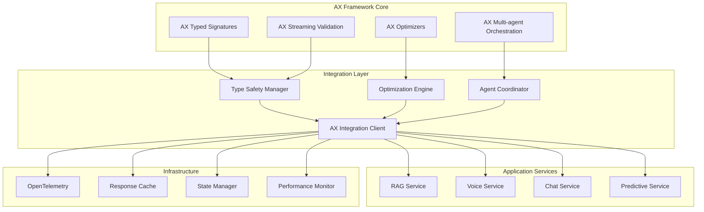

# AX Framework Integration Design

## Overview

The AX Framework Integration provides the foundational layer for building type-safe, self-optimizing AI agents using the AX LLM framework. This integration enables typed prompt signatures, streaming validation, DSPy-inspired optimization, and multi-agent orchestration while maintaining zero dependencies and production-ready reliability.

## Architecture

### System Components



### Data Models

```typescript
// AX Framework integration types
interface AxSignatureDefinition {
  name: string;
  input: AxInputSchema;
  output: AxOutputSchema;
  instructions?: string;
  examples?: AxExample[];
  constraints?: AxConstraint[];
}

interface AxInputSchema {
  [key: string]: AxFieldType;
}

interface AxOutputSchema {
  [key: string]: AxFieldType;
}

interface AxFieldType {
  type: 'string' | 'number' | 'boolean' | 'array' | 'object';
  description?: string;
  validation?: AxValidationRule[];
  required?: boolean;
}

interface AxAgent {
  id: string;
  name: string;
  signature: AxSignatureDefinition;
  optimizer?: AxOptimizer;
  state: AxAgentState;
  metrics: AxAgentMetrics;
}

interface AxOptimizer {
  type: 'bootstrap' | 'copro' | 'mipro';
  config: AxOptimizerConfig;
  trainingData: AxTrainingExample[];
  performance: AxPerformanceMetrics;
}

interface AxAgentState {
  isActive: boolean;
  lastOptimized: Date;
  optimizationCount: number;
  performanceScore: number;
  errorRate: number;
}
```

### Component Architecture

```typescript
// AX Framework Integration Client
export class AxIntegrationClient {
  private typeManager: TypeSafetyManager;
  private optimizer: OptimizationEngine;
  private agentCoordinator: AgentCoordinator;
  private telemetry: OpenTelemetryTracer;
  
  constructor(config: AxIntegrationConfig) {
    this.typeManager = new TypeSafetyManager(config.types);
    this.optimizer = new OptimizationEngine(config.optimization);
    this.agentCoordinator = new AgentCoordinator(config.agents);
    this.telemetry = new OpenTelemetryTracer(config.telemetry);
  }
  
  @AxSignature({
    input: "query: string, context?: string",
    output: "response: string, confidence: number, sources: string[]"
  })
  async processQuery(input: AxQueryInput): Promise<AxQueryOutput> {
    // Implementation with type safety and optimization
  }
  
  async createAgent(definition: AxSignatureDefinition): Promise<AxAgent> {
    // Create new agent with typed signature
  }
  
  async optimizeAgent(agentId: string, feedback: AxFeedback[]): Promise<AxOptimizationResult> {
    // Optimize agent performance using DSPy patterns
  }
}

// Type Safety Manager
export class TypeSafetyManager {
  validateInput<T>(input: unknown, schema: AxInputSchema): T {
    // Runtime type validation with detailed error messages
  }
  
  validateOutput<T>(output: unknown, schema: AxOutputSchema): T {
    // Output validation with correction suggestions
  }
  
  generateTypeDefinitions(signature: AxSignatureDefinition): string {
    // Generate TypeScript type definitions
  }
}
```

## Implementation Strategy

### Vertical Slices

#### Slice 1: Core AX Framework Setup
**Complexity**: ⭐⭐⭐ (3/5)
**Duration**: 1 week

**Components**:
- AX framework installation and configuration
- Basic typed signature implementation
- Type validation system
- Error handling and logging

**TDD Approach**:
```typescript
describe('AxIntegrationClient', () => {
  it('should create client with valid configuration', () => {
    const config: AxIntegrationConfig = {
      types: { strictValidation: true },
      optimization: { enabled: true },
      telemetry: { endpoint: 'http://localhost:4317' }
    };
    
    const client = new AxIntegrationClient(config);
    
    expect(client).toBeInstanceOf(AxIntegrationClient);
    expect(client.isConfigured()).toBe(true);
  });
  
  it('should validate configuration and reject invalid settings', () => {
    const invalidConfig = { types: null };
    
    expect(() => new AxIntegrationClient(invalidConfig as any))
      .toThrow('Invalid configuration');
  });
});
```

#### Slice 2: Typed Signatures and Validation
**Complexity**: ⭐⭐⭐⭐ (4/5)
**Duration**: 1.5 weeks

**Components**:
- Typed signature definition and parsing
- Runtime type validation
- Input/output schema validation
- Type error handling and correction

**TDD Approach**:
```typescript
describe('TypeSafetyManager', () => {
  it('should validate input against schema', () => {
    const manager = new TypeSafetyManager();
    const schema: AxInputSchema = {
      query: { type: 'string', required: true },
      maxResults: { type: 'number', required: false }
    };
    const input = { query: 'test query', maxResults: 5 };
    
    const validated = manager.validateInput(input, schema);
    
    expect(validated.query).toBe('test query');
    expect(validated.maxResults).toBe(5);
  });
  
  it('should reject invalid input types', () => {
    const manager = new TypeSafetyManager();
    const schema: AxInputSchema = {
      query: { type: 'string', required: true }
    };
    const invalidInput = { query: 123 };
    
    expect(() => manager.validateInput(invalidInput, schema))
      .toThrow('Type validation failed: query must be string');
  });
});
```

#### Slice 3: Streaming Validation
**Complexity**: ⭐⭐⭐⭐ (4/5)
**Duration**: 1 week

**Components**:
- Real-time streaming validation
- Progressive type checking
- Stream error recovery
- Validation performance optimization

**TDD Approach**:
```typescript
describe('StreamingValidator', () => {
  it('should validate streaming output in real-time', async () => {
    const validator = new StreamingValidator();
    const schema: AxOutputSchema = {
      response: { type: 'string', required: true }
    };
    
    const stream = createMockStream(['{"response": "partial"', '", "confidence": 0.9}']);
    const validatedStream = validator.validateStream(stream, schema);
    
    const chunks = [];
    for await (const chunk of validatedStream) {
      chunks.push(chunk);
    }
    
    expect(chunks).toHaveLength(2);
    expect(chunks[1].response).toBe('partial');
  });
  
  it('should handle streaming validation errors', async () => {
    const validator = new StreamingValidator();
    const invalidStream = createMockStream(['{"invalid": true}']);
    
    const validatedStream = validator.validateStream(invalidStream, mockSchema);
    
    await expect(async () => {
      for await (const chunk of validatedStream) {
        // Should throw validation error
      }
    }).rejects.toThrow('Streaming validation failed');
  });
});
```

#### Slice 4: Self-Optimizing Agents
**Complexity**: ⭐⭐⭐⭐⭐ (5/5)
**Duration**: 2 weeks

**Components**:
- DSPy-inspired optimization engine
- Agent performance tracking
- Automatic prompt improvement
- Optimization feedback loops

**TDD Approach**:
```typescript
describe('OptimizationEngine', () => {
  it('should optimize agent performance based on feedback', async () => {
    const optimizer = new OptimizationEngine();
    const agent = createMockAgent();
    const feedback = createPositiveFeedback();
    
    const result = await optimizer.optimizeAgent(agent, feedback);
    
    expect(result.performanceImprovement).toBeGreaterThan(0);
    expect(result.optimizedSignature).toBeDefined();
    expect(result.confidence).toBeGreaterThan(0.8);
  });
  
  it('should handle insufficient training data', async () => {
    const optimizer = new OptimizationEngine();
    const agent = createMockAgent();
    const insufficientFeedback = [];
    
    const result = await optimizer.optimizeAgent(agent, insufficientFeedback);
    
    expect(result.status).toBe('insufficient_data');
    expect(result.recommendation).toContain('more training examples');
  });
});
```

#### Slice 5: Multi-Agent Orchestration
**Complexity**: ⭐⭐⭐⭐⭐ (5/5)
**Duration**: 1.5 weeks

**Components**:
- Agent coordination and communication
- Task routing and delegation
- Agent composition patterns
- Inter-agent state management

**TDD Approach**:
```typescript
describe('AgentCoordinator', () => {
  it('should coordinate multiple agents for complex tasks', async () => {
    const coordinator = new AgentCoordinator();
    const ragAgent = createRAGAgent();
    const voiceAgent = createVoiceAgent();
    
    coordinator.registerAgent(ragAgent);
    coordinator.registerAgent(voiceAgent);
    
    const result = await coordinator.processComplexQuery({
      query: 'Explain the maintenance procedure',
      requiresVoice: true,
      requiresDocuments: true
    });
    
    expect(result.usedAgents).toContain('rag');
    expect(result.usedAgents).toContain('voice');
    expect(result.response).toBeDefined();
    expect(result.audioResponse).toBeDefined();
  });
  
  it('should handle agent failures gracefully', async () => {
    const coordinator = new AgentCoordinator();
    const failingAgent = createFailingAgent();
    const backupAgent = createBackupAgent();
    
    coordinator.registerAgent(failingAgent);
    coordinator.registerAgent(backupAgent);
    
    const result = await coordinator.processQuery('test query');
    
    expect(result.usedAgent).toBe('backup');
    expect(result.failureHandled).toBe(true);
  });
});
```

#### Slice 6: OpenTelemetry Integration
**Complexity**: ⭐⭐⭐ (3/5)
**Duration**: 1 week

**Components**:
- Distributed tracing setup
- Metrics collection and export
- Performance monitoring
- Error tracking and alerting

**TDD Approach**:
```typescript
describe('OpenTelemetryIntegration', () => {
  it('should create traces for agent operations', async () => {
    const tracer = new AxTelemetryTracer();
    const mockSpan = createMockSpan();
    
    await tracer.traceAgentOperation('test-agent', async (span) => {
      span.setAttributes({ query: 'test', agentType: 'rag' });
      return { result: 'success' };
    });
    
    expect(mockSpan.setAttributes).toHaveBeenCalledWith({
      query: 'test',
      agentType: 'rag'
    });
    expect(mockSpan.end).toHaveBeenCalled();
  });
  
  it('should export metrics to configured endpoint', async () => {
    const metrics = new AxMetricsExporter();
    const mockMetric = { name: 'agent_response_time', value: 150 };
    
    await metrics.export([mockMetric]);
    
    expect(mockExporter.export).toHaveBeenCalledWith([mockMetric]);
  });
});
```

## Testing Strategy

### Unit Testing with Vitest

```typescript
// AX Framework unit tests
import { describe, it, expect, vi, beforeEach } from 'vitest';
import { AxIntegrationClient } from './AxIntegrationClient';

describe('AxIntegrationClient', () => {
  let client: AxIntegrationClient;
  
  beforeEach(() => {
    client = new AxIntegrationClient({
      types: { strictValidation: true },
      optimization: { enabled: true, algorithm: 'bootstrap' },
      telemetry: { enabled: true }
    });
  });
  
  it('should handle complex industrial queries with type safety', async () => {
    const query = {
      text: 'Troubleshoot hydraulic system pressure drop',
      context: 'maintenance',
      equipmentModel: 'RoboRail-X1'
    };
    
    const result = await client.processQuery(query);
    
    expect(result.response).toBeDefined();
    expect(result.confidence).toBeGreaterThan(0.8);
    expect(result.sources).toBeInstanceOf(Array);
  });
});
```

### Integration Testing

```typescript
// Integration tests for AX Framework
describe('AX Framework Integration', () => {
  it('should integrate with OpenAI Responses API', async () => {
    const axClient = new AxIntegrationClient(config);
    const responsesAPI = new ResponsesAPIClient(apiConfig);
    
    axClient.setLLMProvider(responsesAPI);
    
    const result = await axClient.processQuery({ query: 'test' });
    
    expect(result.source).toBe('responses_api');
    expect(result.typeValidated).toBe(true);
  });
  
  it('should work with voice system for typed voice interactions', async () => {
    const axClient = new AxIntegrationClient(config);
    const voiceSystem = new VoiceInteractionSystem();
    
    const voiceAgent = await axClient.createAgent({
      name: 'voice-rag',
      input: { audioQuery: 'string', context: 'string' },
      output: { textResponse: 'string', audioResponse: 'ArrayBuffer' }
    });
    
    const result = await voiceAgent.process({
      audioQuery: 'maintenance procedure',
      context: 'factory_floor'
    });
    
    expect(result.textResponse).toBeDefined();
    expect(result.audioResponse).toBeInstanceOf(ArrayBuffer);
  });
});
```

## Performance Considerations

### Optimization Strategies

```typescript
export class AxPerformanceOptimizer {
  static optimizeSignature(signature: AxSignatureDefinition): AxSignatureDefinition {
    // Optimize signature for better performance
    return {
      ...signature,
      constraints: this.optimizeConstraints(signature.constraints),
      examples: this.selectBestExamples(signature.examples)
    };
  }
  
  static cacheOptimizedAgents(agent: AxAgent): void {
    // Cache optimized agents for reuse
    if (agent.state.performanceScore > 0.9) {
      this.agentCache.set(agent.signature.name, agent);
    }
  }
  
  static monitorPerformance(agent: AxAgent): AxPerformanceMetrics {
    return {
      responseTime: this.measureResponseTime(agent),
      accuracy: this.measureAccuracy(agent),
      resourceUsage: this.measureResourceUsage(agent)
    };
  }
}
```

## Security Considerations

### Type Safety and Security

```typescript
export class AxSecurityManager {
  static validateSignatureSecurity(signature: AxSignatureDefinition): SecurityValidation {
    // Validate signature for security issues
    return {
      hasInjectionRisks: this.checkInjectionRisks(signature),
      hasDataLeakage: this.checkDataLeakage(signature),
      hasAccessControl: this.checkAccessControl(signature)
    };
  }
  
  static sanitizeInput(input: any, schema: AxInputSchema): any {
    // Sanitize input based on schema
    return Object.keys(schema).reduce((sanitized, key) => {
      sanitized[key] = this.sanitizeField(input[key], schema[key]);
      return sanitized;
    }, {});
  }
  
  static auditAgentOperation(agent: AxAgent, operation: AxOperation): void {
    this.auditLogger.log({
      timestamp: new Date(),
      agentId: agent.id,
      operation: operation.type,
      inputSchema: agent.signature.input,
      outputSchema: agent.signature.output,
      performanceScore: agent.state.performanceScore
    });
  }
}
```

## Deployment Considerations

### Zero-Dependency Architecture

```typescript
// AX Framework configuration for production
export const axProductionConfig: AxIntegrationConfig = {
  types: {
    strictValidation: true,
    generateTypes: true,
    validateAtRuntime: true
  },
  optimization: {
    enabled: true,
    algorithm: 'mipro', // Most advanced optimizer
    trainingDataSize: 1000,
    optimizationInterval: '24h'
  },
  telemetry: {
    enabled: true,
    endpoint: process.env.OTEL_EXPORTER_OTLP_ENDPOINT,
    serviceName: 'roborail-ax-framework',
    tracesSampler: 0.1 // 10% sampling for production
  },
  agents: {
    maxConcurrent: 50,
    timeoutMs: 30000,
    retryAttempts: 3
  },
  performance: {
    cacheEnabled: true,
    cacheTTL: 3600, // 1 hour
    metricsInterval: 60000 // 1 minute
  }
};
```

This design provides a comprehensive foundation for integrating the AX framework with proper TDD practices and vertical slice development approach.