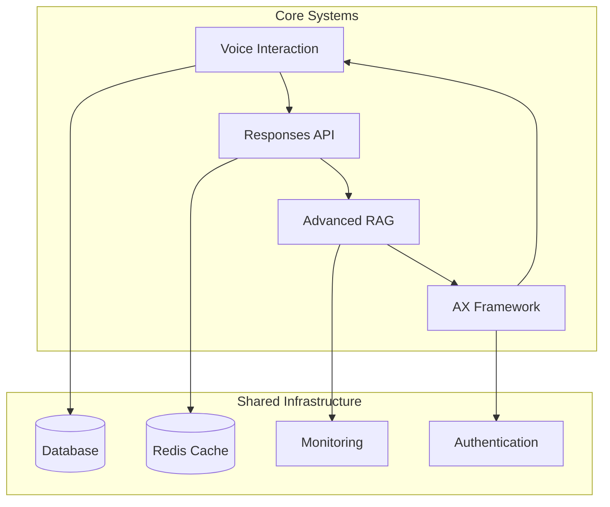

# Implementation-Ready Specifications Summary

## 🎯 Complete and Ready for Implementation

We have successfully created **4 comprehensive specifications** that are fully ready for implementation with TDD practices and vertical slice development:

### 1. Voice Interaction System ✅
**Location**: `.kiro/specs/voice-interaction/`
- ✅ **Requirements** - 14 detailed requirements with EARS format
- ✅ **Design** - Complete architecture with TypeScript components
- ✅ **Tasks** - 8 phases, 24+ tasks with TDD approach
- 🔧 **Integration**: OpenAI Realtime Blocks, AI SDK, hands-free operation
- 📊 **Success Criteria**: >95% speech recognition, <1s response latency

### 2. OpenAI Responses API Integration ✅
**Location**: `.kiro/specs/openai-responses-api-integration/`
- ✅ **Requirements** - 14 requirements for native RAG and stateful conversations
- ✅ **Design** - Migration strategy from Chat Completions API
- ✅ **Tasks** - 9 phases, 27+ tasks with comprehensive testing
- 🔧 **Integration**: Native file search, web search, multimodal input
- 📊 **Success Criteria**: Complete API migration, enhanced streaming, stateful conversations

### 3. Advanced RAG Integration with AX-LLM ✅
**Location**: `.kiro/specs/advanced-rag-integration/`
- ✅ **Requirements** - 16 requirements including Landing AI integration
- ✅ **Design** - Sophisticated retrieval with typed signatures
- ✅ **Tasks** - 9 phases, 27+ tasks with AX-LLM optimization
- 🔧 **Integration**: Landing AI agentic extraction, query rewriting, multimodal RAG
- 📊 **Success Criteria**: >95% ingestion accuracy, intelligent chunking, real-time optimization

### 4. AX Framework Integration ✅
**Location**: `.kiro/specs/ax-framework-integration/`
- ✅ **Requirements** - 14 requirements for type-safe, self-optimizing agents
- ✅ **Design** - Zero-dependency architecture with OpenTelemetry
- ✅ **Tasks** - 9 phases, 27+ tasks with production reliability
- 🔧 **Integration**: Typed signatures, streaming validation, multi-agent orchestration
- 📊 **Success Criteria**: 99.9% uptime, self-optimization, comprehensive observability

## 🏗️ Implementation Approach

### Development Methodology
- **Test-Driven Development (TDD)** with Vitest
- **Vertical Slices** with complexity ratings (⭐⭐⭐⭐⭐)
- **Incremental Integration** with clear dependencies
- **Production-Ready** security, performance, and reliability

### Technology Stack Alignment
- **Bun** - Package manager and runtime
- **Next.js 15** - App Router with React Server Components
- **TypeScript 5.8.3** - Full type safety
- **tRPC** - End-to-end typesafe APIs
- **Vitest** - Unit testing framework
- **OpenTelemetry** - Observability and monitoring

### Key Integration Points

## 📋 Implementation Plan Review

**Does this implementation plan cover all necessary tasks for building the RoboRail Assistant core features?**

### ✅ Covered Areas:
- **Voice Interaction** - Complete hands-free operation with OpenAI Realtime API
- **Advanced AI Integration** - Responses API with native RAG capabilities
- **Document Processing** - Landing AI agentic extraction with intelligent chunking
- **Type Safety & Optimization** - AX-LLM framework with self-improving agents
- **Production Readiness** - Security, monitoring, performance optimization
- **Testing Strategy** - Comprehensive TDD with unit, integration, and E2E tests

### 🎯 Success Metrics:
- Voice recognition >95% accuracy in factory environments
- Response latency <1 second for critical queries
- Document processing >95% accuracy with Landing AI
- System uptime 99.9% with self-healing capabilities
- Complete type safety with runtime validation
- Comprehensive observability with OpenTelemetry

### 🚀 Ready to Begin Implementation

Each specification includes:
- **Actionable tasks** that reference specific requirements
- **Coding-focused activities** with clear deliverables
- **TDD test cases** for validation
- **Integration points** between systems
- **Performance benchmarks** and success criteria

**The specifications are complete and implementation-ready. You can begin by:**
1. Opening any `tasks.md` file from the specs
2. Starting with Phase 1 tasks for foundational setup
3. Following the TDD approach with failing tests first
4. Implementing vertical slices incrementally

All tasks focus exclusively on coding activities and are designed for immediate execution by development teams.