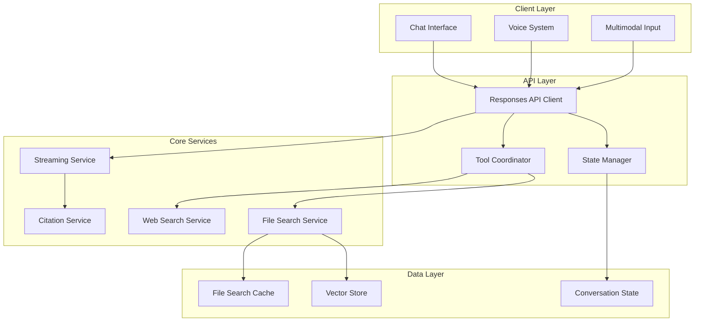

# OpenAI Responses API Integration Design

## Overview

The OpenAI Responses API Integration replaces the traditional Chat Completions API with OpenAI's most advanced interface, providing native RAG capabilities, stateful conversation management, enhanced streaming, and multimodal support. This design follows TDD principles and vertical slice development.

## Architecture

### System Components



### Data Models

```typescript
// Responses API integration types
interface ResponsesAPIClient {
  createResponse(request: ResponseRequest): Promise<ResponseResult>;
  streamResponse(request: ResponseRequest): AsyncIterable<ResponseChunk>;
  getConversationState(responseId: string): Promise<ConversationState>;
  updateConversationState(responseId: string, state: ConversationState): Promise<void>;
}

interface ResponseRequest {
  model: string;
  input: string | MultimodalInput[];
  tools?: Tool[];
  previousResponseId?: string;
  store?: boolean;
  metadata?: Record<string, string>;
  streamingOptions?: StreamingOptions;
}

interface ResponseResult {
  id: string;
  outputText: string;
  annotations: Annotation[];
  toolResults: ToolResult[];
  metadata: ResponseMetadata;
  conversationState: ConversationState;
}

interface MultimodalInput {
  type: 'text' | 'image' | 'audio';
  content: string | ArrayBuffer;
  metadata?: InputMetadata;
}

interface Tool {
  type: 'file_search' | 'web_search' | 'function';
  config: ToolConfig;
}

interface FileSearchTool extends Tool {
  type: 'file_search';
  config: {
    vectorStoreIds: string[];
    maxResults?: number;
    confidenceThreshold?: number;
    filters?: SearchFilters;
  };
}
```

### Component Architecture

```typescript
// Responses API Client Implementation
export class ResponsesAPIClient {
  private openai: OpenAI;
  private stateManager: ConversationStateManager;
  private toolCoordinator: ToolCoordinator;
  
  constructor(config: ResponsesAPIConfig) {
    this.openai = new OpenAI(config.openai);
    this.stateManager = new ConversationStateManager(config.state);
    this.toolCoordinator = new ToolCoordinator(config.tools);
  }
  
  async createResponse(request: ResponseRequest): Promise<ResponseResult> {
    // Implementation with error handling and retry logic
  }
  
  async *streamResponse(request: ResponseRequest): AsyncIterable<ResponseChunk> {
    // Streaming implementation with real-time validation
  }
}

// Stateful Conversation Management
export class ConversationStateManager {
  async createConversation(userId: string): Promise<ConversationState> {
    // Create new conversation with state tracking
  }
  
  async continueConversation(
    responseId: string, 
    input: string
  ): Promise<ResponseRequest> {
    // Continue conversation using response_id reference
  }
  
  async getConversationHistory(responseId: string): Promise<ConversationHistory> {
    // Retrieve conversation context efficiently
  }
}
```

## Implementation Strategy

### Vertical Slices

#### Slice 1: Basic Responses API Integration
**Complexity**: ⭐⭐⭐ (3/5)
**Duration**: 1 week

**Components**:
- OpenAI Responses API client setup
- Basic request/response handling
- Error handling and retry logic
- Simple text-only interactions

**TDD Approach**:
```typescript
describe('ResponsesAPIClient', () => {
  it('should create response with text input', async () => {
    const client = new ResponsesAPIClient(mockConfig);
    const request: ResponseRequest = {
      model: 'gpt-4o',
      input: 'What is the maintenance schedule?'
    };
    
    const response = await client.createResponse(request);
    
    expect(response.id).toBeDefined();
    expect(response.outputText).toBeDefined();
    expect(response.metadata).toBeDefined();
  });
  
  it('should handle API errors gracefully', async () => {
    const client = new ResponsesAPIClient(mockConfig);
    mockOpenAI.responses.create.mockRejectedValue(new Error('Rate limit exceeded'));
    
    await expect(client.createResponse(mockRequest)).rejects.toThrow('Rate limit exceeded');
    expect(mockRetryLogic).toHaveBeenCalled();
  });
});
```

#### Slice 2: File Search Integration
**Complexity**: ⭐⭐⭐⭐ (4/5)
**Duration**: 1.5 weeks

**Components**:
- Native file search tool integration
- Vector store management
- Citation processing and display
- Search result ranking and filtering

**TDD Approach**:
```typescript
describe('FileSearchIntegration', () => {
  it('should perform file search with citations', async () => {
    const client = new ResponsesAPIClient(mockConfig);
    const request: ResponseRequest = {
      model: 'gpt-4o',
      input: 'How do I calibrate the sensor?',
      tools: [{
        type: 'file_search',
        config: { vectorStoreIds: ['vs_123'] }
      }]
    };
    
    const response = await client.createResponse(request);
    
    expect(response.annotations).toHaveLength.greaterThan(0);
    expect(response.toolResults).toContainEqual(
      expect.objectContaining({ type: 'file_search' })
    );
  });
  
  it('should filter search results by metadata', async () => {
    const client = new ResponsesAPIClient(mockConfig);
    const request: ResponseRequest = {
      model: 'gpt-4o',
      input: 'Safety procedures for Model X',
      tools: [{
        type: 'file_search',
        config: {
          vectorStoreIds: ['vs_123'],
          filters: { equipmentModel: 'X', documentType: 'safety' }
        }
      }]
    };
    
    const response = await client.createResponse(request);
    
    expect(response.toolResults[0].results).toEqual(
      expect.arrayContaining([
        expect.objectContaining({ 
          metadata: expect.objectContaining({ equipmentModel: 'X' })
        })
      ])
    );
  });
});
```

#### Slice 3: Stateful Conversation Management
**Complexity**: ⭐⭐⭐ (3/5)
**Duration**: 1 week

**Components**:
- Conversation state tracking
- Response ID management
- Context preservation
- Multi-turn conversation support

**TDD Approach**:
```typescript
describe('ConversationStateManager', () => {
  it('should maintain conversation context', async () => {
    const stateManager = new ConversationStateManager();
    
    const firstResponse = await stateManager.createConversation('user123');
    const secondRequest = await stateManager.continueConversation(
      firstResponse.id,
      'What about the next step?'
    );
    
    expect(secondRequest.previousResponseId).toBe(firstResponse.id);
    expect(secondRequest.store).toBe(true);
  });
  
  it('should handle conversation state persistence', async () => {
    const stateManager = new ConversationStateManager();
    const conversationId = 'conv_123';
    
    await stateManager.saveConversationState(conversationId, mockState);
    const retrievedState = await stateManager.getConversationState(conversationId);
    
    expect(retrievedState).toEqual(mockState);
  });
});
```

#### Slice 4: Enhanced Streaming
**Complexity**: ⭐⭐⭐⭐ (4/5)
**Duration**: 1 week

**Components**:
- Real-time response streaming
- Tool invocation streaming
- Progressive citation delivery
- Stream interruption handling

**TDD Approach**:
```typescript
describe('StreamingService', () => {
  it('should stream responses in real-time', async () => {
    const client = new ResponsesAPIClient(mockConfig);
    const chunks: ResponseChunk[] = [];
    
    for await (const chunk of client.streamResponse(mockRequest)) {
      chunks.push(chunk);
    }
    
    expect(chunks.length).toBeGreaterThan(0);
    expect(chunks[0].type).toBe('text');
    expect(chunks.some(c => c.type === 'tool_invocation')).toBe(true);
  });
  
  it('should handle stream interruption gracefully', async () => {
    const client = new ResponsesAPIClient(mockConfig);
    const abortController = new AbortController();
    
    setTimeout(() => abortController.abort(), 100);
    
    const stream = client.streamResponse({
      ...mockRequest,
      abortSignal: abortController.signal
    });
    
    await expect(async () => {
      for await (const chunk of stream) {
        // Stream should be aborted
      }
    }).rejects.toThrow('AbortError');
  });
});
```

#### Slice 5: Multimodal Input Processing
**Complexity**: ⭐⭐⭐⭐ (4/5)
**Duration**: 1 week

**Components**:
- Text and image input processing
- Multimodal query optimization
- Image understanding integration
- Combined modality responses

**TDD Approach**:
```typescript
describe('MultimodalProcessing', () => {
  it('should process text and image inputs together', async () => {
    const client = new ResponsesAPIClient(mockConfig);
    const request: ResponseRequest = {
      model: 'gpt-4o',
      input: [
        { type: 'text', content: 'What is wrong with this equipment?' },
        { type: 'image', content: mockImageBuffer }
      ],
      tools: [{ type: 'file_search', config: { vectorStoreIds: ['vs_123'] } }]
    };
    
    const response = await client.createResponse(request);
    
    expect(response.outputText).toContain('equipment');
    expect(response.annotations).toHaveLength.greaterThan(0);
  });
  
  it('should handle image analysis with document context', async () => {
    const client = new ResponsesAPIClient(mockConfig);
    const imageInput = createMockEquipmentImage();
    
    const response = await client.createResponse({
      model: 'gpt-4o',
      input: [
        { type: 'text', content: 'Analyze this equipment issue' },
        { type: 'image', content: imageInput }
      ],
      tools: [{ type: 'file_search', config: { vectorStoreIds: ['vs_maintenance'] } }]
    });
    
    expect(response.toolResults).toContainEqual(
      expect.objectContaining({ type: 'file_search' })
    );
    expect(response.outputText).toMatch(/equipment|maintenance|issue/i);
  });
});
```

#### Slice 6: Web Search Integration
**Complexity**: ⭐⭐⭐ (3/5)
**Duration**: 1 week

**Components**:
- Built-in web search tool
- External source integration
- Source credibility assessment
- Hybrid local/web search results

**TDD Approach**:
```typescript
describe('WebSearchIntegration', () => {
  it('should integrate web search when local knowledge is insufficient', async () => {
    const client = new ResponsesAPIClient(mockConfig);
    const request: ResponseRequest = {
      model: 'gpt-4o',
      input: 'Latest safety regulations for industrial equipment 2024',
      tools: [
        { type: 'file_search', config: { vectorStoreIds: ['vs_123'] } },
        { type: 'web_search', config: { maxResults: 5 } }
      ]
    };
    
    const response = await client.createResponse(request);
    
    expect(response.toolResults).toContainEqual(
      expect.objectContaining({ type: 'web_search' })
    );
    expect(response.annotations).toContainEqual(
      expect.objectContaining({ source: expect.stringMatching(/https?:\/\//) })
    );
  });
});
```

## Testing Strategy

### Unit Testing with Vitest

```typescript
// Responses API unit tests
import { describe, it, expect, vi, beforeEach } from 'vitest';
import { ResponsesAPIClient } from './ResponsesAPIClient';

describe('ResponsesAPIClient', () => {
  let client: ResponsesAPIClient;
  let mockOpenAI: any;
  
  beforeEach(() => {
    mockOpenAI = {
      responses: {
        create: vi.fn(),
        stream: vi.fn()
      }
    };
    client = new ResponsesAPIClient({ openai: mockOpenAI });
  });
  
  it('should handle rate limiting with exponential backoff', async () => {
    mockOpenAI.responses.create
      .mockRejectedValueOnce(new Error('Rate limit exceeded'))
      .mockResolvedValueOnce(mockResponse);
    
    const response = await client.createResponse(mockRequest);
    
    expect(mockOpenAI.responses.create).toHaveBeenCalledTimes(2);
    expect(response).toEqual(mockResponse);
  });
});
```

### Integration Testing

```typescript
// Integration tests for Responses API
describe('Responses API Integration', () => {
  it('should integrate with existing chat system', async () => {
    const chatSystem = new ChatSystem();
    const responsesClient = new ResponsesAPIClient(config);
    
    chatSystem.setResponsesClient(responsesClient);
    
    const chatResponse = await chatSystem.processMessage('Test message');
    
    expect(chatResponse.source).toBe('responses_api');
    expect(chatResponse.citations).toBeDefined();
  });
  
  it('should maintain conversation state across requests', async () => {
    const client = new ResponsesAPIClient(config);
    
    const firstResponse = await client.createResponse({
      model: 'gpt-4o',
      input: 'What is calibration?',
      store: true
    });
    
    const secondResponse = await client.createResponse({
      model: 'gpt-4o',
      input: 'How long does it take?',
      previousResponseId: firstResponse.id
    });
    
    expect(secondResponse.outputText).toContain('calibration');
  });
});
```

## Error Handling

### Responses API Error Handling

```typescript
export class ResponsesAPIErrorHandler {
  static handleAPIError(error: Error): ResponsesAPIError {
    if (error.message.includes('rate_limit')) {
      return new ResponsesAPIError('RATE_LIMIT_EXCEEDED', 'API rate limit exceeded', {
        retryAfter: this.extractRetryAfter(error),
        shouldRetry: true
      });
    }
    
    if (error.message.includes('invalid_request')) {
      return new ResponsesAPIError('INVALID_REQUEST', 'Invalid request format', {
        shouldRetry: false
      });
    }
    
    return new ResponsesAPIError('UNKNOWN_ERROR', 'Unknown API error', {
      shouldRetry: true
    });
  }
  
  static async retryWithBackoff<T>(
    operation: () => Promise<T>,
    maxRetries: number = 3
  ): Promise<T> {
    let lastError: Error;
    
    for (let attempt = 0; attempt < maxRetries; attempt++) {
      try {
        return await operation();
      } catch (error) {
        lastError = error as Error;
        const delay = Math.pow(2, attempt) * 1000; // Exponential backoff
        await new Promise(resolve => setTimeout(resolve, delay));
      }
    }
    
    throw lastError!;
  }
}
```

## Performance Considerations

### Optimization Strategies

```typescript
export class ResponsesAPIOptimizer {
  static optimizeRequest(request: ResponseRequest): ResponseRequest {
    // Optimize request for better performance
    return {
      ...request,
      tools: this.optimizeTools(request.tools),
      metadata: this.addPerformanceMetadata(request.metadata)
    };
  }
  
  static cacheResponse(response: ResponseResult): void {
    // Cache responses for similar queries
    if (this.isCacheable(response)) {
      this.responseCache.set(this.generateCacheKey(response), response);
    }
  }
  
  static async getCachedResponse(request: ResponseRequest): Promise<ResponseResult | null> {
    const cacheKey = this.generateCacheKey(request);
    return this.responseCache.get(cacheKey) || null;
  }
}
```

## Security Considerations

### Data Protection

```typescript
export class ResponsesAPISecurityManager {
  static sanitizeRequest(request: ResponseRequest): ResponseRequest {
    return {
      ...request,
      input: this.sanitizeInput(request.input),
      metadata: this.sanitizeMetadata(request.metadata)
    };
  }
  
  static encryptSensitiveData(data: any): EncryptedData {
    // Encrypt sensitive data before sending to API
    return this.encrypt(data, {
      algorithm: 'AES-256-GCM',
      keyDerivation: 'PBKDF2'
    });
  }
  
  static auditAPICall(request: ResponseRequest, response: ResponseResult): void {
    // Log API calls for security auditing
    this.auditLogger.log({
      timestamp: new Date(),
      requestId: response.id,
      userId: request.metadata?.userId,
      toolsUsed: request.tools?.map(t => t.type),
      responseLength: response.outputText.length
    });
  }
}
```

This design provides a comprehensive foundation for migrating to the OpenAI Responses API with proper TDD practices and incremental development through vertical slices.