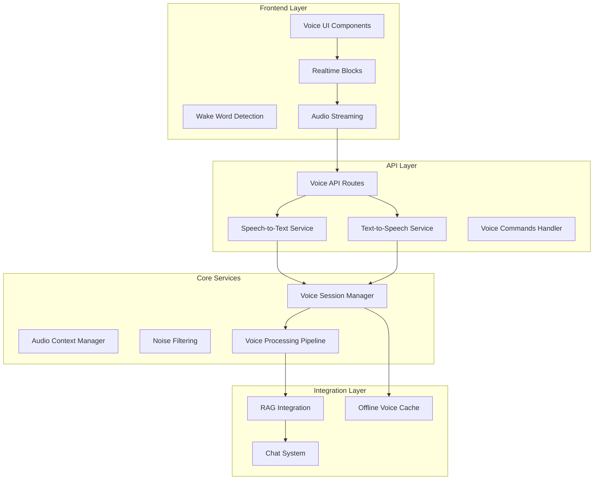

# Voice Interaction System Design

## Overview

The Voice Interaction System provides hands-free, real-time voice communication capabilities using OpenAI's advanced speech models, AI SDK integration, and OpenAI Realtime Blocks components. The system is built with TypeScript, follows TDD principles, and uses vertical slices for incremental development.

## Architecture

### System Components



### Data Models

```typescript
// Core voice interaction types
interface VoiceSession {
  id: string;
  userId: string;
  isActive: boolean;
  audioContext: AudioContextState;
  conversationHistory: VoiceMessage[];
  settings: VoiceSettings;
  createdAt: Date;
  lastActivity: Date;
}

interface VoiceMessage {
  id: string;
  sessionId: string;
  type: 'user' | 'assistant';
  audioData?: ArrayBuffer;
  transcription?: string;
  response?: string;
  confidence: number;
  timestamp: Date;
  metadata: VoiceMessageMetadata;
}

interface VoiceSettings {
  wakeWordEnabled: boolean;
  noiseReduction: boolean;
  voiceSpeed: number;
  voiceStyle: 'professional' | 'friendly' | 'urgent';
  language: string;
  customCommands: CustomVoiceCommand[];
}

interface AudioContextState {
  isRecording: boolean;
  isPlaying: boolean;
  volume: number;
  quality: AudioQuality;
  deviceInfo: AudioDeviceInfo;
}
```

### Component Architecture

```typescript
// Voice UI Component Structure
export const VoiceInterface = () => {
  const { session, startRecording, stopRecording } = useVoiceSession();
  const { transcription, isTranscribing } = useTranscription();
  const { playAudio, isPlaying } = useAudioPlayback();
  
  return (
    <div className="voice-interface">
      <VoiceControls />
      <AudioVisualizer />
      <TranscriptionDisplay />
      <VoiceSettings />
    </div>
  );
};

// Realtime Blocks Integration
export const VoiceTranscriber = () => {
  return (
    <RealtimeTranscriber
      onTranscription={handleTranscription}
      onError={handleTranscriptionError}
      settings={transcriptionSettings}
    />
  );
};
```

## Implementation Strategy

### Vertical Slices

#### Slice 1: Basic Voice Recording and Playback
**Complexity**: ⭐⭐ (2/5)
**Duration**: 1 week

**Components**:
- Basic microphone access and recording
- Simple audio playback functionality
- Voice session management
- Basic UI with record/stop buttons

**TDD Approach**:
```typescript
// Test-driven development for voice recording
describe('VoiceRecorder', () => {
  it('should start recording when microphone access is granted', async () => {
    const recorder = new VoiceRecorder();
    const mockStream = createMockMediaStream();
    jest.spyOn(navigator.mediaDevices, 'getUserMedia').mockResolvedValue(mockStream);
    
    await recorder.startRecording();
    
    expect(recorder.isRecording).toBe(true);
    expect(recorder.audioContext).toBeDefined();
  });
  
  it('should handle microphone access denial gracefully', async () => {
    const recorder = new VoiceRecorder();
    jest.spyOn(navigator.mediaDevices, 'getUserMedia').mockRejectedValue(new Error('Permission denied'));
    
    await expect(recorder.startRecording()).rejects.toThrow('Microphone access required');
  });
});
```

#### Slice 2: Speech-to-Text Integration
**Complexity**: ⭐⭐⭐ (3/5)
**Duration**: 1 week

**Components**:
- OpenAI STT integration using AI SDK
- Real-time transcription display
- Confidence scoring and error handling
- Audio quality optimization

**TDD Approach**:
```typescript
describe('SpeechToTextService', () => {
  it('should transcribe audio with high accuracy', async () => {
    const sttService = new SpeechToTextService();
    const mockAudioBuffer = createMockAudioBuffer();
    
    const result = await sttService.transcribe(mockAudioBuffer);
    
    expect(result.text).toBeDefined();
    expect(result.confidence).toBeGreaterThan(0.8);
    expect(result.language).toBe('en');
  });
  
  it('should handle poor audio quality gracefully', async () => {
    const sttService = new SpeechToTextService();
    const noisyAudioBuffer = createNoisyAudioBuffer();
    
    const result = await sttService.transcribe(noisyAudioBuffer);
    
    expect(result.confidence).toBeLessThan(0.8);
    expect(result.needsClarification).toBe(true);
  });
});
```

#### Slice 3: Text-to-Speech Integration
**Complexity**: ⭐⭐⭐ (3/5)
**Duration**: 1 week

**Components**:
- OpenAI TTS integration using AI SDK
- Voice customization (speed, style, language)
- Audio streaming and playback
- Queue management for multiple responses

**TDD Approach**:
```typescript
describe('TextToSpeechService', () => {
  it('should generate natural-sounding speech', async () => {
    const ttsService = new TextToSpeechService();
    const text = "The maintenance procedure is complete.";
    
    const audioBuffer = await ttsService.synthesize(text, {
      voice: 'professional',
      speed: 1.0,
      language: 'en'
    });
    
    expect(audioBuffer).toBeInstanceOf(ArrayBuffer);
    expect(audioBuffer.byteLength).toBeGreaterThan(0);
  });
  
  it('should emphasize safety warnings appropriately', async () => {
    const ttsService = new TextToSpeechService();
    const safetyText = "WARNING: High voltage area. Use proper PPE.";
    
    const audioBuffer = await ttsService.synthesize(safetyText, {
      voice: 'urgent',
      emphasis: 'safety'
    });
    
    expect(audioBuffer.byteLength).toBeGreaterThan(0);
    // Additional tests for audio characteristics would require audio analysis
  });
});
```

#### Slice 4: Wake Word Detection and Voice Commands
**Complexity**: ⭐⭐⭐⭐ (4/5)
**Duration**: 1.5 weeks

**Components**:
- Wake word detection ("Hey RoboRail")
- Voice command recognition and routing
- Custom command configuration
- Hands-free operation modes

**TDD Approach**:
```typescript
describe('WakeWordDetector', () => {
  it('should detect wake word with high accuracy', async () => {
    const detector = new WakeWordDetector();
    const wakeWordAudio = createWakeWordAudio("Hey RoboRail");
    
    const detected = await detector.detect(wakeWordAudio);
    
    expect(detected.isWakeWord).toBe(true);
    expect(detected.confidence).toBeGreaterThan(0.9);
  });
  
  it('should ignore similar-sounding phrases', async () => {
    const detector = new WakeWordDetector();
    const similarAudio = createAudioBuffer("Hey robot rail");
    
    const detected = await detector.detect(similarAudio);
    
    expect(detected.isWakeWord).toBe(false);
  });
});

describe('VoiceCommandProcessor', () => {
  it('should route commands to appropriate handlers', async () => {
    const processor = new VoiceCommandProcessor();
    const command = "Show maintenance schedule";
    
    const result = await processor.process(command);
    
    expect(result.action).toBe('show_maintenance_schedule');
    expect(result.parameters).toBeDefined();
  });
});
```

#### Slice 5: Integration with RAG and Chat System
**Complexity**: ⭐⭐⭐⭐ (4/5)
**Duration**: 1 week

**Components**:
- Voice query integration with RAG system
- Context preservation across voice interactions
- Citation handling in voice responses
- Multi-turn conversation support

**TDD Approach**:
```typescript
describe('VoiceRAGIntegration', () => {
  it('should integrate voice queries with RAG system', async () => {
    const voiceRAG = new VoiceRAGIntegration();
    const voiceQuery = "How do I calibrate the sensor?";
    
    const response = await voiceRAG.processQuery(voiceQuery);
    
    expect(response.answer).toBeDefined();
    expect(response.citations).toHaveLength.greaterThan(0);
    expect(response.audioResponse).toBeInstanceOf(ArrayBuffer);
  });
  
  it('should maintain context across voice turns', async () => {
    const voiceRAG = new VoiceRAGIntegration();
    
    await voiceRAG.processQuery("What is the calibration procedure?");
    const followUp = await voiceRAG.processQuery("What about the next step?");
    
    expect(followUp.contextPreserved).toBe(true);
    expect(followUp.answer).toContain('calibration');
  });
});
```

#### Slice 6: Advanced Features and Optimization
**Complexity**: ⭐⭐⭐⭐⭐ (5/5)
**Duration**: 2 weeks

**Components**:
- Noise filtering and audio enhancement
- Offline voice capabilities
- Performance optimization
- Analytics and monitoring

## Testing Strategy

### Unit Testing with Vitest

```typescript
// Voice service unit tests
import { describe, it, expect, vi, beforeEach } from 'vitest';
import { VoiceSessionManager } from './VoiceSessionManager';

describe('VoiceSessionManager', () => {
  let sessionManager: VoiceSessionManager;
  
  beforeEach(() => {
    sessionManager = new VoiceSessionManager();
  });
  
  it('should create new voice session', async () => {
    const session = await sessionManager.createSession('user123');
    
    expect(session.id).toBeDefined();
    expect(session.userId).toBe('user123');
    expect(session.isActive).toBe(true);
  });
  
  it('should handle concurrent sessions', async () => {
    const session1 = await sessionManager.createSession('user1');
    const session2 = await sessionManager.createSession('user2');
    
    expect(session1.id).not.toBe(session2.id);
    expect(sessionManager.getActiveSessions()).toHaveLength(2);
  });
});
```

### Integration Testing

```typescript
// Voice integration tests
describe('Voice Integration Tests', () => {
  it('should handle complete voice interaction flow', async () => {
    const voiceSystem = new VoiceInteractionSystem();
    
    // Start recording
    await voiceSystem.startRecording();
    
    // Simulate audio input
    const audioInput = createMockAudioInput("What is the maintenance schedule?");
    await voiceSystem.processAudio(audioInput);
    
    // Verify transcription
    expect(voiceSystem.lastTranscription).toContain('maintenance schedule');
    
    // Verify response generation
    const response = await voiceSystem.getLastResponse();
    expect(response.text).toBeDefined();
    expect(response.audio).toBeDefined();
  });
});
```

### E2E Testing with Playwright

```typescript
// Voice E2E tests
import { test, expect } from '@playwright/test';

test('voice interaction flow', async ({ page }) => {
  await page.goto('/voice-interface');
  
  // Grant microphone permissions
  await page.context().grantPermissions(['microphone']);
  
  // Click voice button
  await page.click('[data-testid="voice-record-button"]');
  
  // Verify recording state
  await expect(page.locator('[data-testid="recording-indicator"]')).toBeVisible();
  
  // Simulate voice input (would require audio injection in real test)
  await page.evaluate(() => {
    window.mockVoiceInput('Show me the safety procedures');
  });
  
  // Verify response
  await expect(page.locator('[data-testid="voice-response"]')).toContainText('safety');
});
```

## Error Handling

### Voice-Specific Error Handling

```typescript
export class VoiceErrorHandler {
  static handleMicrophoneError(error: Error): VoiceError {
    if (error.name === 'NotAllowedError') {
      return new VoiceError('MICROPHONE_PERMISSION_DENIED', 'Microphone access is required for voice interaction');
    }
    if (error.name === 'NotFoundError') {
      return new VoiceError('MICROPHONE_NOT_FOUND', 'No microphone device found');
    }
    return new VoiceError('MICROPHONE_UNKNOWN', 'Unknown microphone error');
  }
  
  static handleTranscriptionError(error: Error): VoiceError {
    if (error.message.includes('confidence')) {
      return new VoiceError('LOW_CONFIDENCE', 'Could not understand speech clearly');
    }
    return new VoiceError('TRANSCRIPTION_FAILED', 'Speech recognition failed');
  }
}
```

## Performance Considerations

### Audio Processing Optimization

```typescript
export class AudioOptimizer {
  static optimizeForFactory(audioBuffer: ArrayBuffer): ArrayBuffer {
    // Apply noise reduction for factory environments
    return this.applyNoiseReduction(audioBuffer, {
      profile: 'industrial',
      aggressiveness: 0.7
    });
  }
  
  static compressForStreaming(audioBuffer: ArrayBuffer): ArrayBuffer {
    // Compress audio for real-time streaming
    return this.compress(audioBuffer, {
      bitrate: 64000, // 64kbps for voice
      format: 'opus'
    });
  }
}
```

## Security Considerations

### Voice Data Protection

```typescript
export class VoiceSecurityManager {
  static encryptVoiceData(audioBuffer: ArrayBuffer): EncryptedAudioData {
    // Encrypt voice data before transmission
    return this.encrypt(audioBuffer, {
      algorithm: 'AES-256-GCM',
      keyDerivation: 'PBKDF2'
    });
  }
  
  static sanitizeTranscription(text: string): string {
    // Remove potential sensitive information from transcriptions
    return this.removePII(text);
  }
}
```

## Deployment Considerations

### Environment Configuration

```typescript
// Voice service configuration
export const voiceConfig = {
  openai: {
    sttModel: process.env.OPENAI_STT_MODEL || 'gpt-4o-transcribe',
    ttsModel: process.env.OPENAI_TTS_MODEL || 'gpt-4o-mini-tts',
    voice: process.env.OPENAI_VOICE_STYLE || 'professional'
  },
  audio: {
    sampleRate: 16000,
    channels: 1,
    bitDepth: 16,
    maxRecordingDuration: 30000 // 30 seconds
  },
  performance: {
    maxConcurrentSessions: 10,
    transcriptionTimeout: 5000,
    ttsTimeout: 10000
  }
};
```

This design provides a comprehensive foundation for implementing the voice interaction system with proper TDD practices and vertical slice development approach.